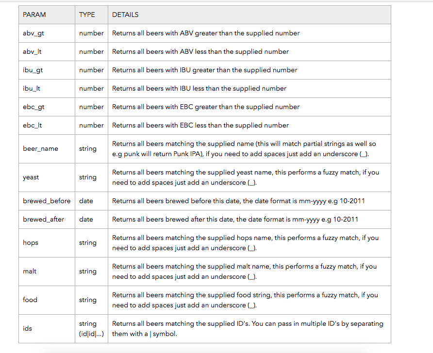

# Punk API 

Service Object Models for the [Punk API](https://punkapi.com/documentation/v2)

## Installation

* Clone or download the files from the git repo 
* Use the ```ruby beers_object.rb``` command in the terminal (or using the bash shell in Windows) to run the ruby script
* Modify the beers_object.rb file as directed below for services, or follow instructions for testing below

## Services

* If there is not an object already instantiated, instantiate an object of the BeerServices class  
e.g. ```beer = BeerServices.new``` 
* To find a single beer based on the id, add the following code: ```beer.single_beer_service('id')```
* To display all of the beers, use the ```beer.all_beers_service``` code
* To display a random beer, use the following code: ```beer.random_beer_service```
* There is also a service for searching using one or more search parameters - the following code block shows an example of how this service could be used:

```
beer.check_for_params({'yeast' => 'Wyeast_1056_-_American_Ale', 'abv_gt' => 8})
beer.add_params_to_url
beer.search_beers
```

**Table 1**

* The ```check_for_params``` method is the method in which the user can enter search paramaters as a **hash**
* Please note that curly brackets **'{}'** are required, as well as the older 'hash rocket' notation **'=>'**

## Methods

#### single\_beer\_service 

* Method for returning a single beer
* Has 1 argument - beer_id, which is the id of the beer you want to find
* **Note** - not to be confused with the search parameter **ids**
* It is also important to enter the number of the id in quotes - e.g. ```beer.single_beer_service('5')```

#### all\_beers\_service

* Method for returning all of the beers
* No arguments for this method
* Add ```beer.all_beers_service``` to code

#### random\_beer\_service

* Method for returning a random single beer
* No arguments for this method
* Add ```beer.random_beer_service``` to code

#### check\_for\_params

* Method that compares user entered paramaters to an array of possible parameters listed in **Table 1**
* Number of arguments depends on the user
* User will enter a **hash** - method will then compare each key to the items in the array
* If there is no match, an error is raised
* If there is a match, the key :value pairs are pushed into a key and value array respectively
* Example code: ```beer.check_for_params({'yeast' => 'Wyeast_1056_-_American_Ale', 'abv_gt' => 8})```

#### add\_params\_to\_url

* Method runs after the check\_for\_params method
* Purpose is to construct an appropiate query url/uri
* First checks if the key and value arrays have anything in them, if there is only 1 thing in them, then a question mark is added to the beginning of the url
* Next, the first value of the key array is added, then an equals sign, then the first value of the value array is added
* If there is more than one value, the first value of the key and value arrays are added as above, except there is a for loop that loops through the key array, adding keys and values to the url, except with an '&' at the beginning

#### search_beers 

* Final method for query parameters
* Parses the JSON and appends the dynamically generated url to the base_uri
* No arguments

## Testing

* Ensure that there is a spec directory and .rspec file in the repo 
* If there isn't, run the ```rspec --init``` command in the terminal (or bash shell for Windows)
* The spec_helper.rb file can be configured to your liking - the recommended configuration is below:

```
require 'json'
require 'httparty'

RSpec.configure do |config|
  config.formatter = :documentation
end
```
* Create a file in the spec directory where tests will be run - it can be called anything, but **must** have \_spec.rb at the end  - in this case, the name of the file is beer_spec.rb
* To run the tests, run the ```rspec``` command

## Technologies

* Ruby **2.4.2**
* rspec **3.1.2**
* httparty gem **0.15.6**
* json gem **1.8.3**
* git for version control **2.14.2**